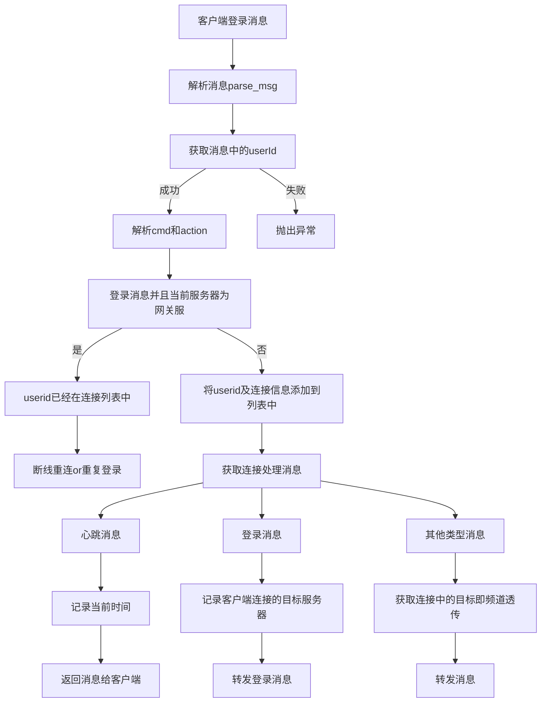
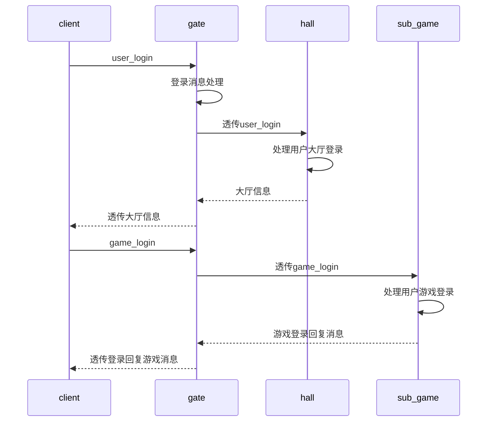
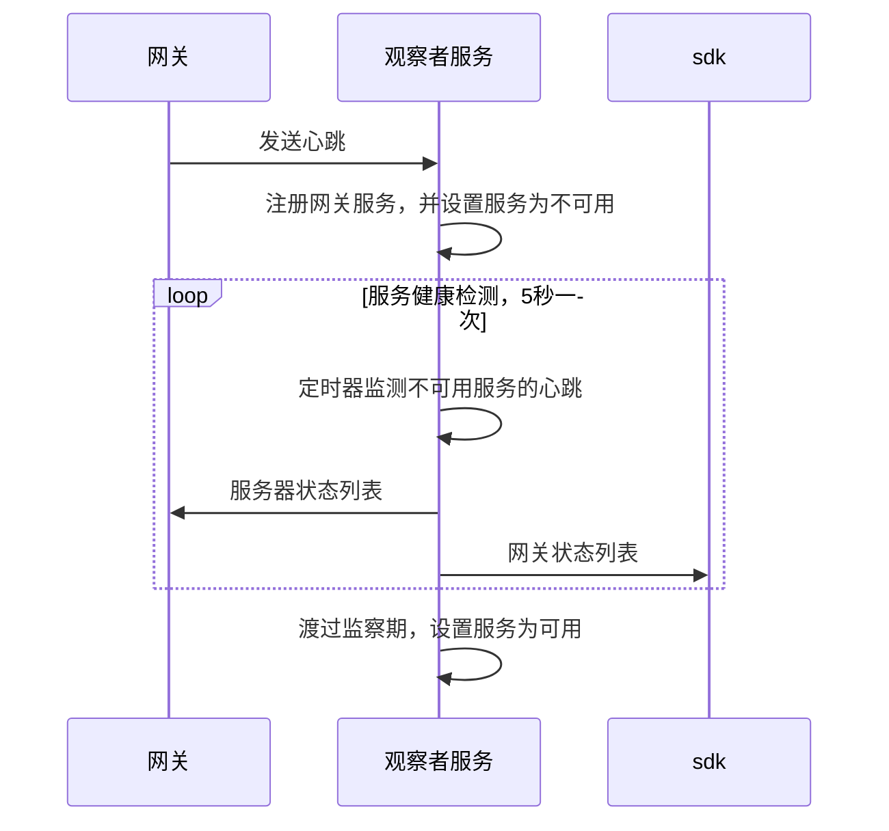

# 客户端发送消息流程

以user_login消息为例, 正常情况下网关收到的客户端的第一条消息一定是user_login

# 客户端登录并进入游戏时序

# 服务器启动时序

> + 客户端需要从sdk获取服务器列表，如果观察者服务没有启动，则客户端获取不到服务器列表，这是客户端可以提示用户服务器维护中，
> + 服务器启动没有顺序要求，但是，必要要观察者服务启动后，并推送服务器列表给sdk客户端才能获取到服务器列表，
> + 其他服务注册到观察者服务后不是马上可用的，服务有健康观察期，观察期过后会将其置为可用状态，之后才会将可用的服务器列表推送给sdk，
> + 除观察者服务外，其他服务每次心跳会携带物理机的cpu使用率，内存占用率，进程的连接数等数据，观察者服务会根据这些数据来计算服务进程的评分，来做负载均衡

1. 网关

# 断线重连策略

当检测到断线后，便可以启动重连模式。根据当前的游戏状态确定重连策略，一般有以下三种方式：

1) 静默重连，即在用户无感知的情况下进行重连。一般检测到断线后，可以先尝试静默重连一定次数（比如3次）。如果在游戏对战过程中断线，一般也会尽量尝试静默重连并且忽略重连次数，因为此时弹出提示框会打断对战体验的完整性。静默重连提供了一种友好的用户体验，能应付一些短暂的网络中断（比如进出电梯或者进程从后台唤醒等）。

2) 显式重连，在静默重连一定次数（假定3次）之后，仍然无法连接成功的情况下，此时需要弹出提示框，中断游戏流程，告知用户当前网络环境较差，引导用户在网络较好时再尝试连接。

3) 服务器故障重连，这种情况下客户端无论如何是连接不到游戏服务器的。此时客户端也需要给出正确的引导，而不是误当作断线故障处理。因此我们在断线重连失败之后多加一个步骤：尝试连接CDN服务器，若CDN服务器可以正常连接，那么说明网络畅通，我们去获取CDN上的云配置，检查是否有服务器日常维护的标识，如果有则给出服务器日常维护的公告，否则可以认为服务器宕机，则给出服务器故障的公告。此步骤中若CDN服务器也无法连接，说明网络确实不畅通，可以继续走重连流程或者等待。

# 玩家切换场景、下线、断线处理

每个scene服务器维护了一个session列表，该列表存储了当前连接到本服的玩家的session信息，scene服务通过事件处理器订阅UserSceneChangeEvent来维护列表

1. 玩家下线，玩家下线一定是在大厅，大厅收到玩家下线消息，清除本服的session列表中的玩家
2. 玩家切换场景，当前的场景会收到玩家的game_enter消息，所有的场景服务器都是如此，收到消息后当前的场景会将玩家的session信息添加到session列表，并更新redis中的session信息，不管玩家的session信息是否存在。同时发送game_change消息给gate，更新gate上的玩家session信息，gate上的session信息存储在connection中。上一个场景会收到玩家的game_leave消息，删除本服上玩家的session信息。
3. 玩家断线(gate检测心跳超时)，gate检测到玩家断线根据connection中存储的信息，发送game_leave消息给场景服务器，清除session信息