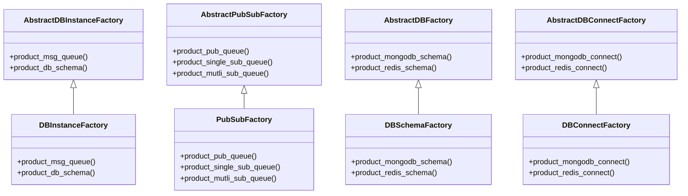

# 数据库类说明

## 工厂类图

## 工厂类说明

DBInstanceFactory为数据库实例工厂类，负责生成消息队列工厂类实例和数据库操作工厂类实例

PubSubFactory为消息队列工厂类，负责生成发布消息队列类实例、单订阅消息队列类实例和多订阅消息队列类实例

DBSchemaFactory为数据库操作工厂类，负责生成mongodb操作类实例和redis操作类实例

DBConnectFactory为数据库连接工厂类，负责生成mongodb和redis的连接实例

# mongodb数据说明

## account库

### user集合

存储玩家基础信息，冷数据，userId，创建时间及其他信息

# redis数据说明

redis数据分为玩家个人数据和游戏公共数据，玩家个人数据指的是玩家在游戏内的数据，每个游戏不同。游戏公共数据指的是某个游戏的数据，比如：德州的排行榜等

## session:userId(hash)

存储玩家连接信息

> + gate: 玩家连接的网关

> + ip: 玩家ip

## game:gameId:userId(hash)

玩家游戏数据，gameId为其所玩的游戏id

